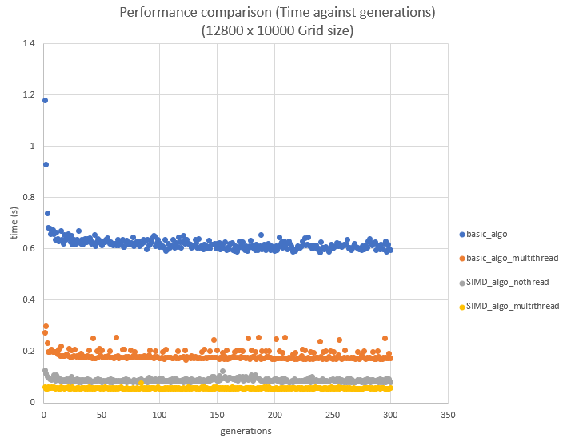

# Conway-Game-Of-Life
Parallel Conway Game Of Life implementation, with SIMD and multithreading techniques.

<a href="https://www.youtube.com/watch?v=Dp-l4arYM74&ab_channel=JerSow">Video Demo</a>

# Benchmark Results
CPU used: i7-7700HQ  
the game is benchmarked for up to 300 generations. It can be seen that initial multithreaded performance has improve the game compute time. SIMD, however, was even better, as SIMD utilizes memory/cache efficiently by performing multiple computes, and the memory access in is continuous form. A bad implementation of SIMD is commented out in the code (using __mm256_set), which produced worse results to the default algorithm. Adding multithreading to SIMD showed only minimal performance, as the algorithm as most likely load bound. The task granularity of the threaded code was made a small as possible to give it a slight edge over SIMD with no threading. Overall, nice project to understand paralleism. However, according to the internet, the fastest implemetnation would be the HashLife algorithm.
  

# Program Usage
Requires Visual Studio 2017 minimum, and SFML.
Press Q,W,E and R to alternate between computation methods.  
Press L to log data into the results_csv file. (300 generations of simulation).  
Up, Down, Left and Right to Move aroudn the world.
